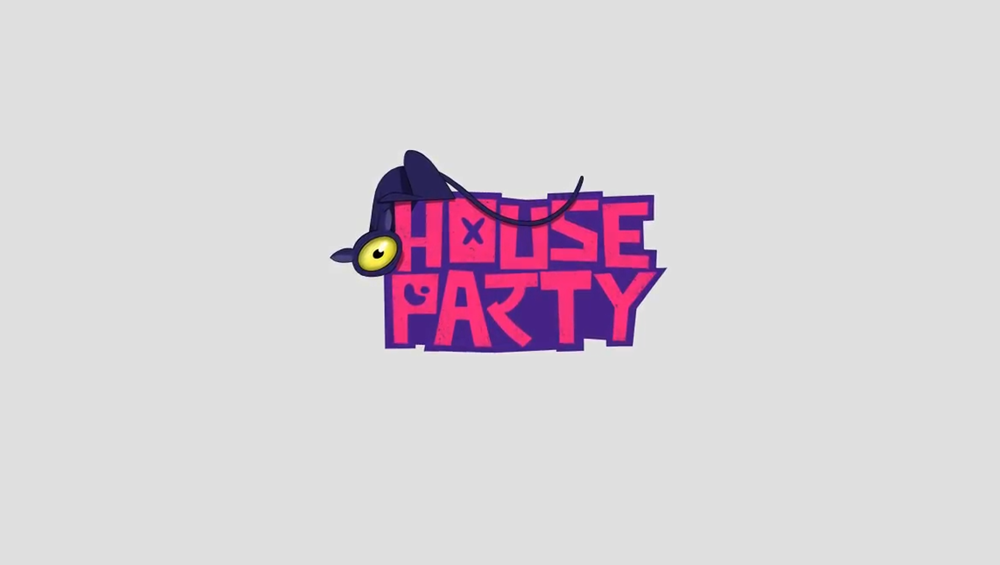
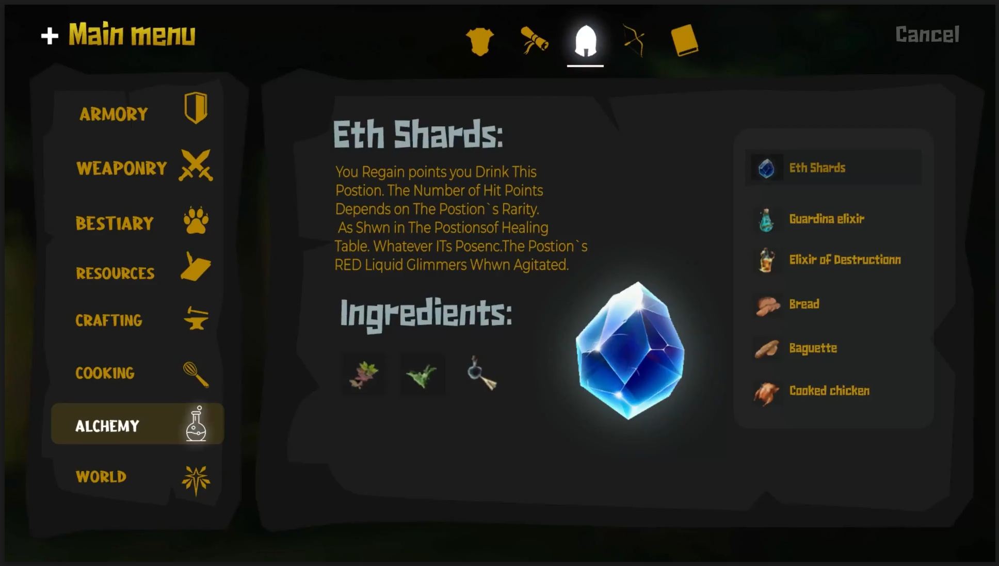
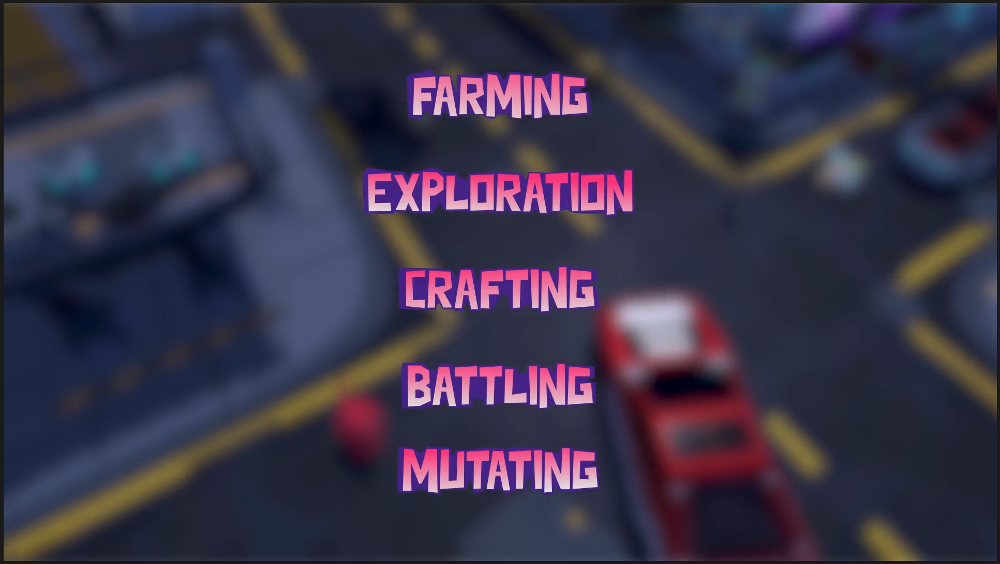

# 🕹️ HP: The Adventure of Knoobs
**HP: The Adventure of Knoobs** is a **blockchain-powered Unity game** that fuses **classic farming, crafting, and exploration** with new-gen **Web3 mechanics**, giving players the power to truly **own, trade, and mutate** their digital assets.

What if players could step into a **vibrant, open-world adventure** where every crafted weapon, harvested crop, and mutated item is an **NFT they can trade or evolve on-chain**?  
What if **ownership and rewards were transparent and truly player-first**, with sustainable **play-to-earn incentives** and secure **blockchain wallet integration**?

This project harnesses **Unity URP, Blender, Ethereum smart contracts, and a custom Web3 API** to deliver a **next-generation play-to-earn gaming ecosystem** for both **PC and WebGL**.

---

## 📑 Contents
- [🌍 Overview](#-overview)
- [🔄 Workflow Summary](#-workflow-summary)
- [🏗 Virtual Environment](#-virtual-environment)
- [🎮 Gameplay Features](#-gameplay-features)
- [🧩 Blockchain Integration](#-blockchain-integration)
- [📝 UI & Controls](#-ui--controls)
- [🧪 Deployment](#-deployment)
- [🎯 Technology Stack](#-technology-stack)
- [✅ Outcome](#-outcome)
- [🔐 Data Privacy & Security](#-data-privacy--security)

---

## 🌍 Overview
**House Party: The Adventure of Knoobs** merges **Unity’s immersive gameplay** with **blockchain-backed digital ownership**. Players can:

- Explore **open-world fantasy and urban maps**  
- **Craft items, mutate assets, and grow resource farms**  
- **Battle enemies, gather loot, and evolve weapons** into rare **NFT variants**

All playable assets — tools, weapons, skins — are **minted as NFTs**, enabling **true digital possession, trading, and evolution** within a **community-driven economy**.

---

## 🔄 Workflow Summary
- **Game Design** → Defined core farming, battling, crafting, and mutation systems centered around **player agency, NFT creation, and discovery**.  
- **3D Asset Creation** → Built **character models, props, UI, and stylized environments** using **Blender** and **Unity’s URP pipeline**.  
- **Blockchain ↔ Gameplay Integration** → Wrote **Ethereum-compatible smart contracts** for assets, wallets, and the **game marketplace**. Developed a **Web3 API** to connect **Unity with on-chain actions**.  
- **Iteration & Tuning** → Balanced resource drops, combat mechanics, and mutation outcomes through **iterative design and continuous playtesting**.

---

## 🏗 Virtual Environment
- **Stylized urban-fantasy world** with **interactive crafting, farming, and alchemy stations**  
- **Dynamic NPCs** to guide, battle, and trade with  
- **Battle arenas** and **resource-rich farming zones** woven into explorable maps  

---

## 🎮 Gameplay Features
- **Farming & resource collection** for crafting and trade  
- **Expansive exploration** with hidden loot and story quests  
- **Deep crafting system** for weapons, consumables, and upgrades  
- **Battles against AI mutants** using melee and ranged fighting  
- **Mutation system** where assets can evolve into **rare, powerful variants**  

 

---

## 🧩 Blockchain Integration
- **NFT minting** → Weapons, skins, and rare items minted directly to **user wallets**  
- **Secure integrated wallet connections** for in-game and on-chain actions  
- **Marketplace** for **player-driven asset trading**  
- **Play-to-earn incentives** → Resource farming, battle wins, and item crafting  

---

## 📝 UI & Controls
Main menu modules include:  
**Armory, Weaponry, Bestiary, Crafting, Cooking, Alchemy, World**

- All panels built with **custom Unity UI**, ensuring **fluid navigation** between **inventory, resource management, and crafting flows**

 

---

## 🧪 Deployment
- Built for **PC and WebGL deployments** on **Unity URP**  
- **Smart contract logic** deployed on **Ethereum-compatible chains**  
- Future scope includes **mobile versions**

---

## 🎯 Technology Stack

### 🔹 Backend
- Blockchain **smart contracts (Solidity)**  
- **Web3 API** for Unity integration  
- **NFT minting and marketplace system**

### 🔹 Frontend
- **Unity URP + C# scripting**  
- **Blender (3D modeling)**  
- **Shader Graph** for stylized visuals  
- **Custom UI design** for digital asset management and gameplay modules  

---

## ✅ Outcome
Knoobs delivers a **future-proof blockchain gaming experience** where:  
- All in-game assets are **player-owned NFTs**, tradeable and upgradable  
- Classic **adventure & farming gameplay** merges seamlessly with **play-to-earn on-chain mechanics**  
- Transparent reward models encourage **sustained community engagement** and **digital asset liquidity**

---

## 🔐 Data Privacy & Security
Our security-first approach includes:  
- **Encrypted wallet connections**  
- **Audited, transparent smart contracts**  
- **Regular security reviews** and compliance with **Web3 privacy best practices** for all player data and assets  

---
